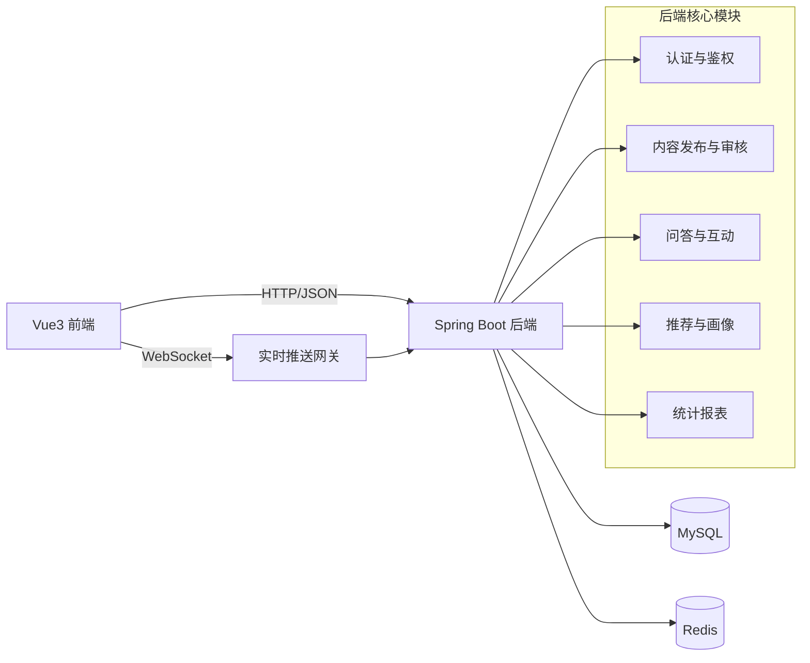
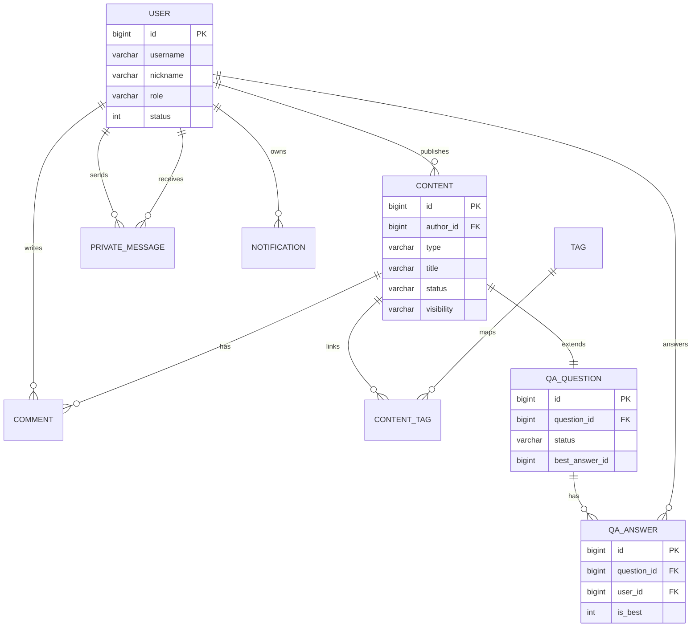
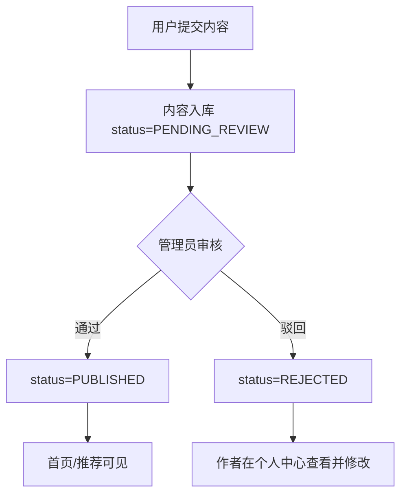
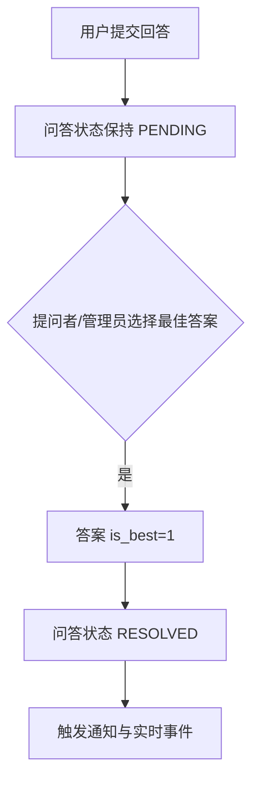
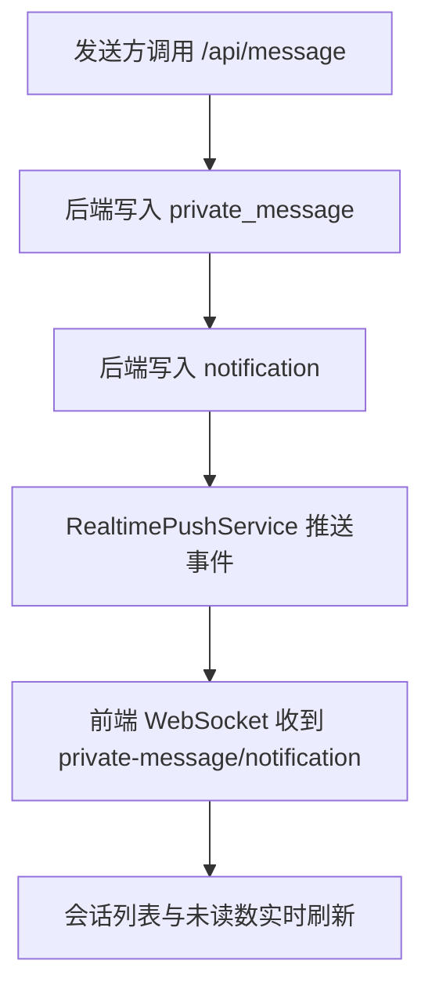

# 论文图表与测试表（可直接引用）

## 1. 系统架构图

## 2. 数据库 E-R 图（核心实体）

## 3. 关键流程图

### 3.1 内容发布与审核流程

### 3.2 问答最佳答案流程

### 3.3 私信实时推送流程

## 4. 测试用例表（中期/答辩可直接展示）

| 用例编号 | 测试目标 | 前置条件 | 操作步骤 | 预期结果 | 实际结果 |
|---|---|---|---|---|---|
| TC-01 | 用户登录 | 演示账号已初始化 | 输入 author_lin / User@123456 登录 | 返回 token，进入首页 | 通过 |
| TC-02 | 内容发布审核链路 | 管理员账号可用 | 用户发布内容，管理员在审核台通过 | 内容状态变为 PUBLISHED | 通过 |
| TC-03 | 私密可见性控制 | 存在 PRIVATE 内容 | 非作者访问详情/搜索/推荐 | 返回不可见或不展示 | 通过 |
| TC-04 | 私信发送与会话更新 | 双方账号在线 | A 给 B 发送私信 | B 会话未读数+1，历史记录可见 | 通过 |
| TC-05 | 私信实时推送 | B 连接 WebSocket | A 发送私信 | B 收到 private-message 事件 | 通过 |
| TC-06 | 通知实时推送 | B 连接 WebSocket | 触发评论/私信通知 | B 收到 notification 事件 | 通过 |
| TC-07 | 通知已读回执 | B 连接 WebSocket | 执行 read-all | 收到 notification-read 事件 | 通过 |
| TC-08 | 推荐解释展示 | 推荐页可访问 | 打开推荐列表 | 展示推荐分、推荐理由、标签 | 通过 |
| TC-09 | 报表图表展示 | 报表页可访问 | 打开 /report | 展示柱图、环图、折线图 | 通过 |
| TC-10 | 管理员用户管理 | 管理员登录 | 停用普通用户后再启用 | 用户状态可切换且有提示 | 通过 |
| TC-11 | 管理员内容管理 | 管理员登录 | 批量查询并修改内容状态 | 状态更新并记录审核日志 | 通过 |
| TC-12 | 附件上传能力 | 登录用户 | 在发布页上传图片/附件并插入正文 | 正文中可插入访问链接 | 通过 |

## 5. 图表引用建议（论文正文）

- 架构设计章节：使用“系统架构图”。
- 数据库设计章节：使用“E-R 图”。
- 核心功能实现章节：使用 3.1、3.2、3.3 流程图。
- 系统测试章节：直接引用“测试用例表”。
